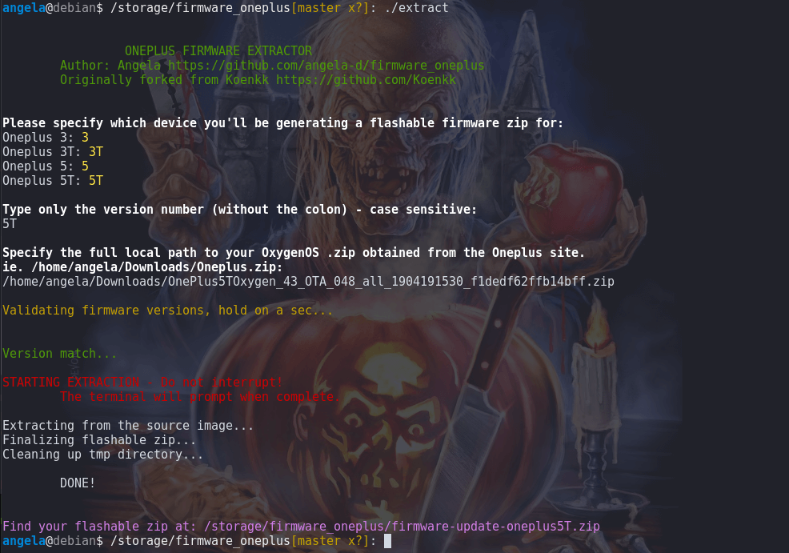
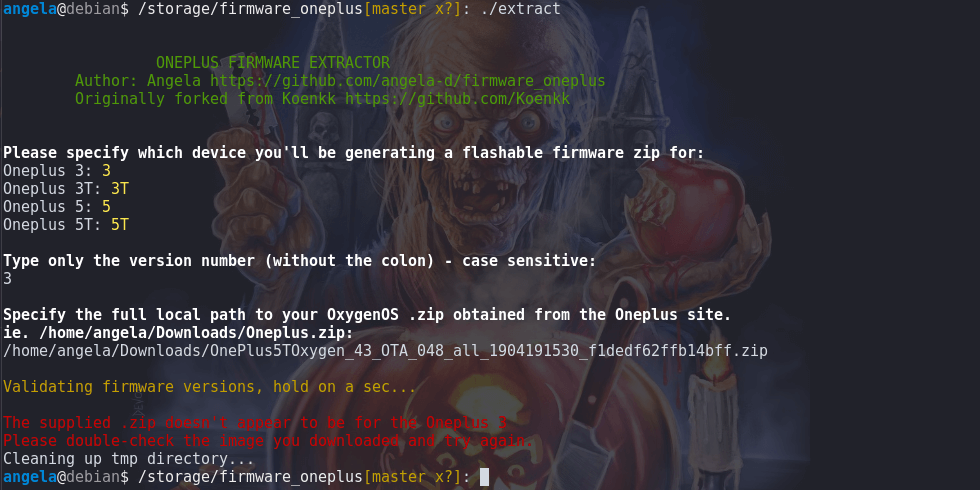
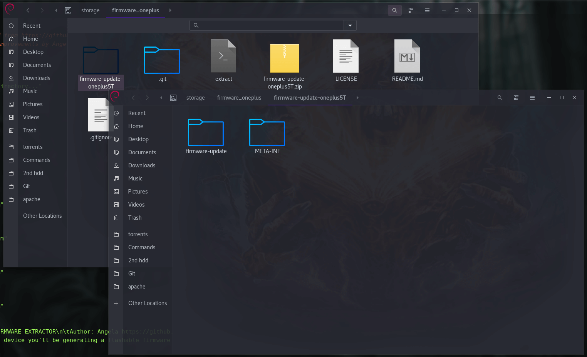

# Oneplus Firmware Extractor
Easily extract the firmware and modem from stock OxygenOS images for use with other roms.

## No OxygenOS flash to your device is necessary
You can sideload the extracted firmware without needing to flash OxygenOS over your existing Lineage or MicroG Lineage OS.

Extract the official firmware by yourself, without relying on third parties or potentially untrustworthy hosting sites.

## Compatibility
To run the extract script:
- Any operating system with bash; all Linux distros and MacOS.  Not tested on Windows or WSL.

Device:
- For Oneplus 3, 3T, 5 and 5T devices

Lineage/MicroG Lineage versions:
- v16 / Android 9 Pie
- v17 / Android 10

*Later versions of Lineage may work, but have not been tested.  Use at your own risk for beta versions!*

## How to Use
1. Clone this repository
```bash
git clone --depth=1 https://github.com/angela-d/firmware_oneplus.git
```
*(Use --depth=1 to avoid pulling in legacy objects from the original repo)*

2. Obtain the *latest* copy of OxygenOS from [Oneplus](https://www.oneplus.com/support/softwareupgrade) as a **.zip**
3. In your terminal, navigate to the directory where you cloned this repo: `cd firmware_oneplus && ls -l` - if you see the directory contents, you're ready to go

As of v2.0, the command-line options have been greatly simplified, using interactive prompts.

To trigger the tool, simply run:

```bash
./extract
```
or
```bash
/path/to/extract
```
That's it!  The screen will prompt and guide you through the process.

Successful image generated:




Image mis-match (built-in error checking):




Pre-packaged zip ready to go (the screenshot is focused on the *extracted* image, showing that all of the OxygenOS stuff is gone and only the desired update remains):



***

## Updating Your Device
Once **extract** completes, locate your flashable zip (the terminal will tell you the path!)

- Connect your device to your computer via USB and run `adb devices` from your terminal to initiate a connection
- In TWRP Recovery (if you aren't in recovery yet: [instructions to get there](boot-into-recovery.md)):


1. Advanced
2. Sideload
3. TWRP will prompt sideloading has started; from your terminal, run:
```bash
adb sideload firmware-update-oneplus5T.zip
```

That's it.

Note: If you tried to update before flashing the firmware, you may get an "update failed" notification once Lineage boots back up.  Simply go to Settings > Update > Install again and let it do it's thing.  It should then finish the upgrade with the latest Oneplus firmware.

## Current Firmware
See note about OTA updates below.

Obtain the original Oxygen image from [Oneplus](https://www.oneplus.com/support/softwareupgrade) for your device.

- As of Oct 31, 2020 the latest firmware for [Oneplus 5 cheeseburger](https://review.lineageos.org/c/LineageOS/android_device_oneplus_cheeseburger/+/287278/) is **10.0.0 hotfix 1**
- As of Nov 14, 2020 the latest firmware for [Oneplus 5T dumpling](https://review.lineageos.org/c/LineageOS/android_device_oneplus_dumpling/+/292284) is **10.0.1**
- As of Jun 15, 2019 the latest firmware for [Oneplus 3/3T oneplus3](https://github.com/LineageOS/android_device_oneplus_oneplus3/commit/97803deb60f30939ba2c3fa8637a7812f89c5b1b) is **9.0.2**

Note that 3/3T has Lineage v16 & v17 available; v17 has **not** been tested with this script.

## OTA Updates
Over the air (OTA) updates requiring the latest firmware aren't always forced by Lineage / MicroG Lineage, even if Oneplus has published a later version than what you're running.

In this event:
1. Check [download.lineageos.org](https://download.lineageos.org/) for your specific device -> Recent changes
2. Scroll until you see a "firmware" change referenced with the latest version number listed

If nothing (later than your running version) is there, go about your day (or, force a firmware update if you really want to).

Forcing a firmware update appears to be successful, but the "Vendor security patch" displayed in **Settings > About phone > Android version** still won't update.


### Caveats
No responsibility to anyone but yourself if you brick your device!

## Author & License
Forked concept originally by [Koenkk](https://github.com/Koenkk/firmware_oneplus); his commits licensed under public domain (no license)

Code by [Angela](https://github.com/angela-d) licensed under GPL2
